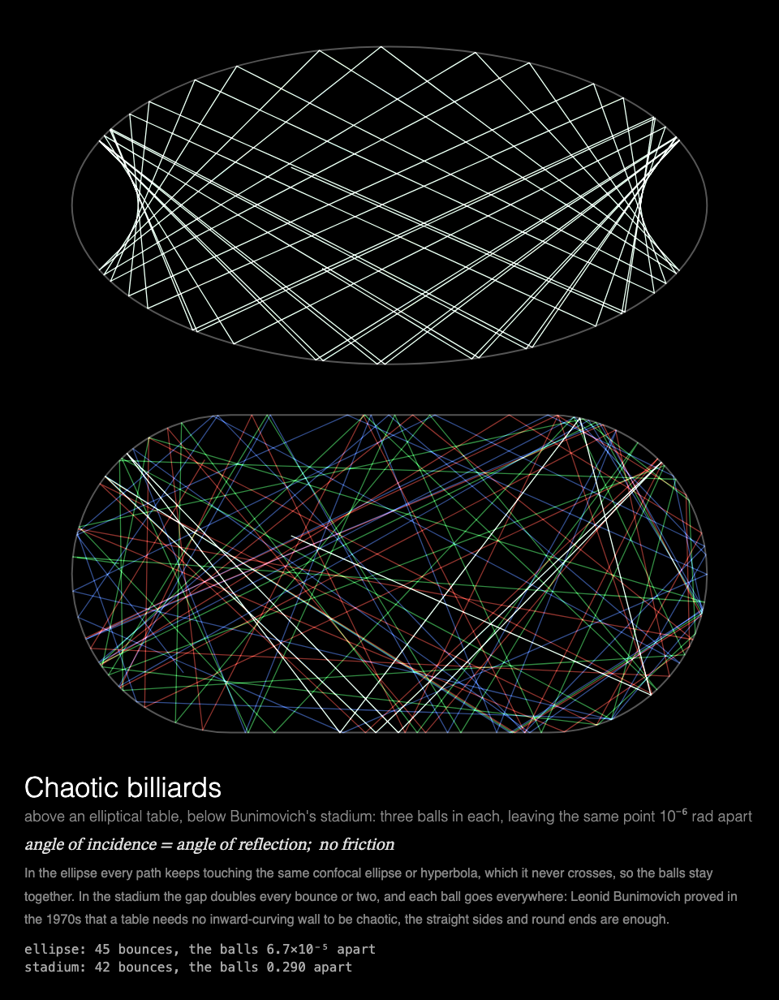

# MMM-ChaoticBilliards

A [MagicMirror²](https://magicmirror.builders/) module that plays billiards on two tables at once, an ellipse and Bunimovich's stadium, to show order and chaos coming from the shape of the table alone.



## What you see

**Chaotic billiards.** An elliptical table above Bunimovich's stadium, the same size, three balls
in each leaving the same point 10⁻⁶ rad apart, red, green and blue, so that while they agree they
add up to white. Drawn as a long exposure: in the ellipse they stay together, one white path
fenced in by its caustic; in the stadium they part within a few bounces and go everywhere. Each
showing starts from the same point in a new random direction.

Under the tables: the only law there is (angle of incidence = angle of reflection, no friction),
a note on why the two tables differ, and a readout of each table's bounces and how far apart its
balls are.

Built for a **Raspberry Pi 3 without GPU acceleration**: everything is drawn by the CPU, each
frame adds only the balls' new paths, and the animation stops while the module is hidden (see
[Performance](#performance)).

## Installation

```bash
cd ~/MagicMirror/modules
git clone https://github.com/charleswest775/MMM-ChaoticBilliards
```

No npm dependencies: there is nothing to install.

## Update

```bash
cd ~/MagicMirror/modules/MMM-ChaoticBilliards
git pull
```

## Configuration

```js
{
	module: "MMM-ChaoticBilliards",
	position: "middle_center",
	config: {
		cycleSeconds: 60,  // start afresh every minute
		width: 900,
		height: 900,
		fps: 20
	}
},
```

| Option | Default | Description |
|---|---|---|
| `cycleSeconds` | `60` | Start again, in a new direction, this often; it also starts again each time the module is shown again |
| `width`, `height` | `900` | Canvas size in pixels |
| `fps` | `20` | Frame-rate cap |
| `showMath` | `true` | Equations and live numbers under the canvas |
| `turns` | `null` | Take turns with other modules on the same page, e.g. `{ of: 3, at: 1 }` (see [Taking turns](#taking-turns)) |
| `statsPanel` | `false` | A line under the math showing what the mirror spends: fps, CPU of Electron and the compositor, a bar per core, temperature. Sampled by the module's `node_helper` from `/proc`, only while the module is shown |
| `debugStats` | `false` | Show achieved fps and per-frame timings in the corner of the screen |

## Taking turns

With `turns: { of: n, at: k }`, modules on the same [MMM-pages](https://github.com/edward-shen/MMM-pages)
page each show on their own one in n showings of it: `at: 0` on the first showing and every
nth after it, `at: 1` on the second, and so on. A module that isn't on its turn takes no room on
the page and costs nothing: it hides its canvas and doesn't start. So one slot in the rotation
can hold several pages, without making the rotation longer. For example, three chaos
simulations, one per showing: [MMM-ThreeBody](https://github.com/charleswest775/MMM-ThreeBody),
the billiards and [MMM-Rule30](https://github.com/charleswest775/MMM-Rule30):

```js
{
	module: "MMM-ThreeBody",
	classes: "page-chaos",
	position: "middle_center",
	config: { turns: { of: 3, at: 0 } }
},
{
	module: "MMM-ChaoticBilliards",
	classes: "page-chaos",
	position: "middle_center",
	config: { turns: { of: 3, at: 1 } }
},
{
	module: "MMM-Rule30",
	classes: "page-chaos",
	position: "middle_center",
	config: { turns: { of: 3, at: 2 } }
},
{
	module: "MMM-pages",
	config: { modules: [["page-clock"], ["page-chaos"]], rotationTime: 60000 }
},
```

Without `turns` the module shows every time. It works just as well on a page of its own, or in
a normal region without MMM-pages, where it starts again every `cycleSeconds`.

## What's real

Nothing but the law of reflection: the balls roll in straight lines at a constant speed and
bounce off the wall with the angle of incidence equal to the angle of reflection, with no
friction and no spin. Each bounce is found exactly, not by small time steps: the point where the
ball's straight line meets the ellipse, or one of the stadium's straight sides or round ends
(`simulations/billiards.js`), and the ball's direction is mirrored in the wall's normal there.
The ellipse has semi-axes 1 and ½; the stadium is two half circles of radius ½ joined by straight
sides 1 long, so it too is 2 long and 1 wide.

In the ellipse every path stays tangent to one confocal ellipse or hyperbola, its caustic, which
it never crosses: the table is integrable, and the balls drift apart only in proportion to the
bounces. In the stadium the gap doubles every bounce or two, and each ball visits every part of
the table: Leonid Bunimovich proved in the 1970s (1974, 1979) that a table needs no
inward-curving wall to be chaotic; the straight sides and round ends are enough.

The tests check that on both tables the balls stay inside at unit speed and each bounce flips
the part of the velocity along the wall's normal and keeps the part along the wall; that in the
ellipse the product of the angular momenta about its two foci, the quantity that makes it
integrable, stays the same over 3000 steps; that after 40 bounces the stadium's balls are more
than 10⁻² apart while the ellipse's are still under 10⁻³; and that one stadium ball, over many
bounces, reaches all four quarters of the table and both round ends.

## Performance

Measured on a Raspberry Pi 3 B+ (Electron 42, software rendering), 900×900 at 20 fps, as CPU of
the Electron processes plus the `cage` compositor, in % of one core (the Pi has four); baseline
mirror without the module: 0.2%.

| | % of one core | achieved fps |
|---|---|---|
| module **hidden** (e.g. another MMM-pages page) | 0.3 | 0 |
| over a 60 s showing | 58 | 22 |

Why it costs what it does, from micro-benchmarks on the Pi:

- There is no GPU acceleration to be had (the Pi 3's GPU only does GLES 2.0; Chromium needs
  3.0), so every pixel is drawn by the CPU.
- Any frame that changes the canvas costs ~2% of a core per fps, before drawing anything.
- On top of that, cost grows with the **area that changes**: Chromium redraws the bounding box
  of everything touched in a frame. So the billiards are a long exposure that only adds the
  balls' new paths, and each frame draws on one table only, in turn, so a frame's changes stay
  in one half of the picture.
- JavaScript is not the bottleneck (under 3 ms a frame).
- The frame loop sleeps with `setTimeout` until a frame is due, capped at `fps`. While
  MagicMirror² fades the module out, nothing new is drawn; once it is hidden, the loop stops.

## Development

```bash
node --test                  # physics checks (no dependencies)
python3 -m http.server       # then open http://localhost:8000/dev/preview.html
```

`dev/preview.html` runs the module outside MagicMirror², in a portrait 1200×1920 frame, with
hide/show buttons that follow MagicMirror²'s suspend/resume order. Query options override the
config, e.g. `?fps=30`, `?cycleSeconds=20` or `?statsPanel=true`.

## License

MIT

Part of a family of MagicMirror² modules. Chaos, one simulation each:
[MMM-LorenzAttractor](https://github.com/charleswest775/MMM-LorenzAttractor),
[MMM-DoublePendulum](https://github.com/charleswest775/MMM-DoublePendulum),
[MMM-FractalBasins](https://github.com/charleswest775/MMM-FractalBasins),
[MMM-LogisticMap](https://github.com/charleswest775/MMM-LogisticMap),
[MMM-SymmetricIcons](https://github.com/charleswest775/MMM-SymmetricIcons),
[MMM-ThreeBody](https://github.com/charleswest775/MMM-ThreeBody) and
[MMM-Rule30](https://github.com/charleswest775/MMM-Rule30), or all eight in one module,
[MMM-ChaosTheory](https://github.com/charleswest775/MMM-ChaosTheory).
And more pages of physics and mathematics:
[MMM-Atom](https://github.com/charleswest775/MMM-Atom),
[MMM-FractalZoom](https://github.com/charleswest775/MMM-FractalZoom),
[MMM-Chladni](https://github.com/charleswest775/MMM-Chladni),
[MMM-SacredGeometry](https://github.com/charleswest775/MMM-SacredGeometry),
[MMM-Tilings](https://github.com/charleswest775/MMM-Tilings),
[MMM-PlanetsDance](https://github.com/charleswest775/MMM-PlanetsDance),
[MMM-SnowCrystal](https://github.com/charleswest775/MMM-SnowCrystal) and
[MMM-NightSky](https://github.com/charleswest775/MMM-NightSky).
